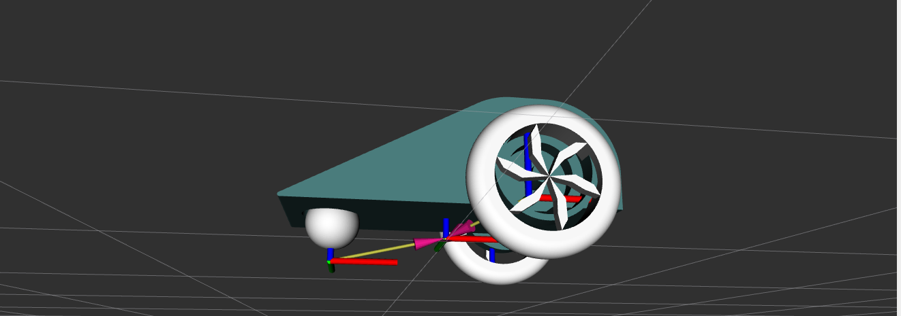
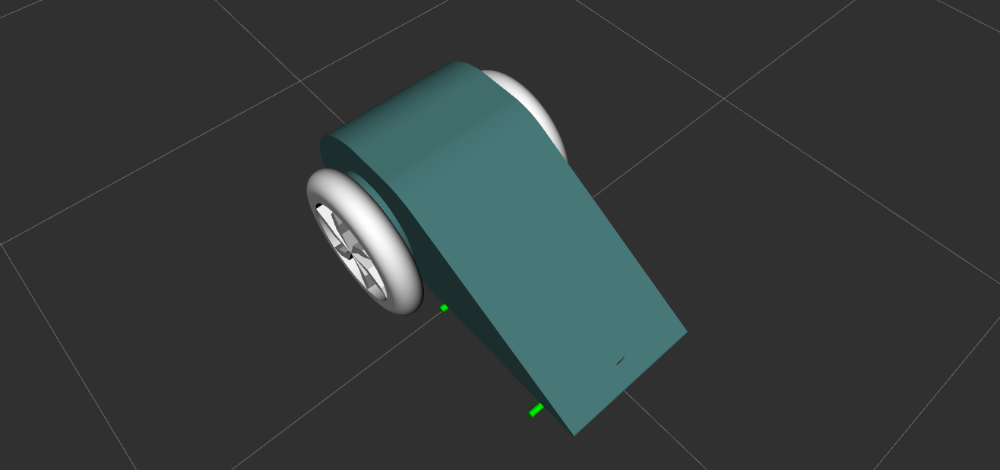

# Robot URDF and XACRO 

This repository demonstrates my skills in creating **URDF (Unified Robot Description Format)** and **XACRO (XML Macros)** files for a robot model. The robot was designed using **Onshape**, a cloud-based CAD software, and the meshes were extracted and converted for use in **ROS 2**. The goal of this project is to showcase a well-designed, detailed robot model using URDF and XACRO, with a focus on visualization in **RViz**. and motion simulation in ** Gazebo**

## Table of Contents

1. [Overview](#overview)
2. [Robot Design](#robot-design)
3. [URDF and XACRO Details](#urdf-and-xacro-details)
4. [How to Launch the Robot Model in RViz](#how-to-launch-the-robot-model-in-rviz)
5. [Screenshots](#screenshots)
6. [Key Features and Skills](#key-features-and-skills)
7. [Installation](#installation)
8. [Licensing](#licensing)

---

## Overview

This project features a **robot model** designed and developed using **ROS 2**, utilizing **URDF** and **XACRO** files to describe the robot's physical properties and kinematics. The robot model can be visualized in **RViz**, and motion simulation in **Gazebo** and the corresponding configuration enables simulation using the `diff_drive_controller`. This repository highlights my ability to transform a CAD model into a usable robotic model for ROS-based systems.

## Robot Design

The robot model is based on a design created in **Onshape**, a professional cloud-based CAD tool. The model has been fully constructed and exported to work with ROS, focusing on a **differential drive robot** configuration with precise wheel placements, sensors, and other key mechanical features.

The robot design includes:
- **Chassis** with accurate dimensions and geometry
- **Wheels** with properly defined joint configurations
- **Links** with defined physical properties such as mass, inertia, and geometry
- **Visual meshes** exported directly from Onshape and converted into appropriate formats for ROS integration

## URDF and XACRO Details

The robot's URDF is structured using **XACRO** macros, which help reduce redundancy and increase modularity. The **XACRO** file contains:
- **Robot links**: Defining the robot's parts (e.g., base, wheels, sensors) and their properties.
- **Joints**: Defining the relationships and movement constraints between links (e.g., rotating wheels, turning axis).
- **Transmission**: Configuring robot actuators, such as motors for differential drive.
- **Collision elements**: Defining interactions in simulation (for simulators like Gazebo, if needed).
- **Visual elements**: Using meshes exported from Onshape and referenced in the URDF for visualization in RViz.

## How to Launch the Robot Model in RViz

Follow these steps to visualize the robot in **RViz**:

1. Clone this repository into your ROS 2 workspace:
   ```bash
   cd ~/ros2_ws/src
   git clone https://github.com/yourusername/robot_car.git
   cd ..
   colcon build
   ros2 launch robot_car display.launch.py

## Thank you
